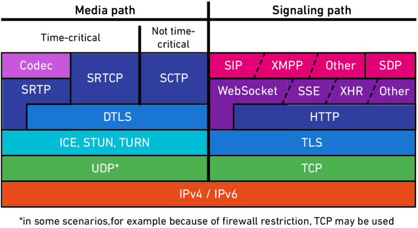

# State of P2P Networking & QUIC-based approaches

*Franz Heinzmann, n0 computer*

P2P Basel 2026

---

## P2P means many things

**local-first** — apps that work offline and sync whenever

**decentralized** — no central servers are required for operation

**symmetric** — every node is client and server

--> "Walk-away stack": Data structures independent of data transmission

**direct** — data flows directly between nodes

---

## Direct connections

* Let data flow directly between any device

--> We need NAT holepunching

* Requires UDP based protocol
* Requires coordination

---

## Packets are not enough: What do we want from a connection?

* Connection multiplexing for independent protocols
* Ordered and reliable streams of data
* Stream multiplexing for independent data flows
* Unordered delivery for real-time data
* End-to-end encryption

---

## Support systems needed for direct connections

○ **Address Discovery**: find your public IP:port

○ **NAT Traversal**: coordinate holepunching

○ **Path Migration**: survive network changes

○ **Multipath**: use multiple paths simultaneously

○ **Relaying**: fallback for connectivity when direct connection is not possible

---

## UDP-based protocols

| Protocol | Used by | Reliable | Encryption | Multiplexing |
|--|-|---|--|-|
| µTP | BitTorrent | yes | no/on top | no |
| SCTP | WebRTC | yes | DTSL | no |
| UDX | Hypercore | yes | no/on top | yes |
| **QUIC** | HTTP/3 | yes | TLS 1.3 | yes |

---

## Support systems

| Need | Protocol |
|---|---|
| Address Discovery | STUN + bespoke |
| NAT Traversal | ICE + bespoke |
| Path Migration | often unsupported |
| Multipath | rarely supported |
| Relaying | TURN + bespoke |

---

## Example: WebRTC stack

<small>
Source: Martin Meszaros, https://www.researchgate.net/publication/328334940_Definition_and_Analysis_of_WebRTC_Performance_Parameters_as_well_as_Conception_and_Realization_of_an_End-to-End_Audio_Quality_Monitoring_Solution_for_WebRTC-Based_immmr_Call_Scenarios
</small>

---

# QUIC

A UDP-Based Multiplexed and Secure Transport

RFC 9000

---

## QUIC overview

* `UDP based` --> holepunchable
* `TLS 1.3` mandatory encryption
* `0-RTT` first packet can carry application data
* `Cheap streams` Multiplexing as core premise
* `Datagram API` Unordered writes are possible
* `ALPN` Protocol negotiation built-in through TLS 1.3 extension
* `extensible` Designed for extensions, many exist already

---

## What are QUIC extensions?

QUIC extensions can ...

* Define new `Transport Parameters`
  * exchanged in first handshake packet
  * identified by a VarInt (IANA registered or provisional number)
  * are used for extension negotiation
  * can carry initial parameters 

* Define new `Frame types`
  * identified by a VarInt (IANA registered or provisional number)
  * Contain arbitrary data within a QUIC connection
  * Can define whether they should be ack-eliciting or not

* Define changes to the protocol flow

---

## QUIC extensions useful for P2P settings

| | |
|---|---|
| Address Discovery | `ietf-quic-address-discovery-00` |
| NAT Traversal | `seemann-quic-nat-traversal-02`, iroh impl (yet unspecced) |
| Multipath | `draft-ietf-quic-multipath-19` |
| Relaying | MASQUE, QMux, .. |

---

## QUIC Address Discovery

`draft-ietf-quic-address-discovery` (early stage, not yet final)

> An endpoint that negotiated this extension and offered to provide address observations to the peer MUST send an `OBSERVED_ADDRESS` frame on every new path. This also applies to the path used for the QUIC handshake. The OBSERVED_ADDRESS frame SHOULD be sent as early as possible.

---

## Paths in QUIC

* Core QUIC supports migrating a connection to a new network path
* New paths are *validated* before data is sent (anti amplification)
* Once migrated the old path may no longer be used
* Only clients can migrate
* When changing the path a new connection id is used: No linkability on the wire

---

## Path validation

* `PATH_CHALLENGE` frame is sent over the new path
* `PATH_RESPONSE` frame to reply
* Only then the path is validated and anti-amplification limit is removed

---

## QUIC Multipath

### Managing multiple paths for a QUIC connection

`draft-ietf-quic-multipath-19` (nearly final)

> This document specifies a multipath extension for the QUIC protocol to enable the simultaneous usage of multiple paths for a single connection. It proposes a standard way to create, delete, and manage paths using identifiers. It does not specify address discovery or management, nor how applications using QUIC schedule traffic over multiple paths.

---

## QUIC Multipath

* Maintain multiple network transmission paths simultaneously
* Path validation remains required
* Paths use different connection ids (no linkability for wire observers)
* Paths have independent package number spaces, ACKs, congestion controllers
* Packet scheduling is undefined (up to the implementation)

---

## NAT Traversal

### Using QUIC to traverse NATs
`draft-seemann-quic-nat-traversal-02` (early stage)

* Basic premise:
  * Both endpoint send frames with their socket addresses
  * Both endpoint pair addresses
  * Both endpoint send `PATH_CHALLENGE` frames simultaneously
  * Holes are punched
  * New paths are opened
  
* Iroh implements a variation (not yet specced)

---

## QUIC Beyond IP

* QUIC only describes IP transports
* QUIC *impl* may be abstract over the concrete "socket"
* iroh does this to implement relay & *custom* transports
  * Iroh implements the "virtual socket": Send & recv UDP packets over other transports
  * Use address mapping to translate from concrete transport-specific address to a virtual IPv6 address
  * QUIC stack sees only virtual IPv6 address
  * Use QUIC multipath to maintain these paths concurrently
* Transmission may be losy
* MTU must be at least 1200 bytes

---

## Debugging & observability: QLOG

### qlog: Structured Logging for Network Protocols

`draft-ietf-quic-qlog-main-schema-13`

> qlog provides extensible structured logging for network protocols, allowing for easy sharing of data that benefits common debug and analysis methods and tooling.

### QUIC event definitions for qlog

` draft-ietf-quic-qlog-quic-events-12`

> This document describes a qlog event schema containing concrete qlog event definitions and their metadata for the core QUIC protocol and selected extensions.

---

# Q&A
